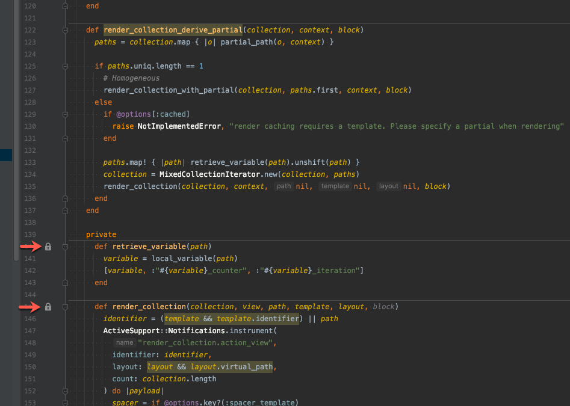

# Accessorize plugin for Jetbrains IDEs

<!-- Plugin description -->

Add an indication of method access levels.  
Accessorize displays an icon next to protected and private Ruby methods to indicate their access level.

<!-- Plugin description end -->

## Installation

- Using IDE built-in plugin system:

  <kbd>Settings/Preferences</kbd> > <kbd>Plugins</kbd> > <kbd>Marketplace</kbd> > <kbd>Search for "Accessorize"</kbd> >
  <kbd>Install Plugin</kbd>

